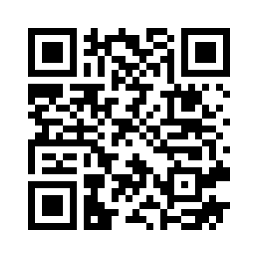
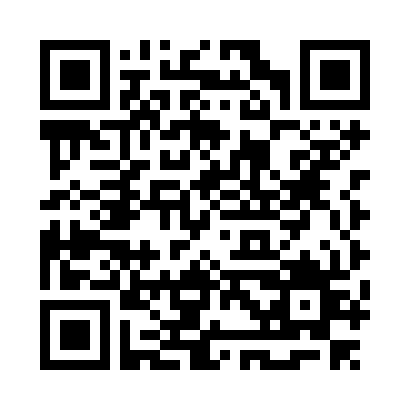

 \[[🇧🇷 Português](README.pt_BR.md)\] \[**[🇺🇸 English](README.md)**\]
  <!--  START HEADER  -->  

<br><br>


# <p align="center">  💎 Diamond Valuation Prediction

<br>

This repository contains a Python project for  analyzing a dataset of diamond characteristics and predicting their price using machine learning techniques.

## Table of Contents

- [Introduction](#introduction)
- [Dataset](#dataset)
- [Methodology](#methodology)
- [Findings](#findings)
- [Analysis of Numerical Features](#analysis-of-numerical-features)
- [Analysis of Categorical Features](#analysis-of-categorical-features)
- [Insights](#insights)
- [Recommendations](#recommendations)
- [Conclusion](#conclusion)
- [File Structure](#file-structure)
- [Getting Started Cloning](#getting-started)
- [Contributing](#contributing)
- [Git Commands](#GitCommands)
- [Codes and Data Analysis Report](#Report)
- [Access the Streamlit Site](https://diamondsvalues.streamlit.app/)  <!-- - [ Tap here and teleport to the site]() 🇺🇸  --> 
- [QR Coides](#QRCodes)
- [Our Team](#our-team)
- [Code of Conduct](#code-of-conduct)
- [License](#license)

#
  
##  📚 Introduction 

This project explores the fascinating world of diamonds and seeks to predict their price based on a variety of factors. We aim to uncover the hidden relationships between diamond characteristics and their value, ultimately contributing to a deeper understanding of the diamond market.

The purpose of this predictive analysis is to create a website that determines the price of a diamond based on its characteristics: carat, cut, color, clarity, price, depth, table, x (length), y (width), and z (depth). 
However, in extreme cases where a quick estimate of a diamond’s value is needed, it is not feasible to spend time defining all these characteristics. Therefore, it is necessary to conduct a study of the database to determine what are the minimum necessary characteristics to accurately estimate the price of a diamond. To implement the project, it is essential to assess how each characteristic of the diamond influences its price. This requires discovering how the variability of a characteristic can affect the variability of the price. Therefore, the use of statistical strategies will be crucial to answer these questions and ensure the accuracy of the diamond value estimate
  
#

## Dataset 📊

The dataset used in this project is "Diamonds_values_faltantes.csv" and includes the following columns:

| Column Name | Description |
|---|---|
| carat | Weight of the diamond in carats |
| cut | Quality of the diamond's cut (Ideal, Premium, Very Good, Good, Fair) |
| color | Color of the diamond (D, E, F, G, H, I, J) |
| clarity | Clarity of the diamond (IF, VVS1, VVS2, VS1, VS2, SI1, SI2, I1) |
| depth | Percentage of the diamond's depth |
| table | Percentage of the diamond's table width |
| price | Price of the diamond in US dollars |
| x | Length of the diamond in millimeters |
| y | Width of the diamond in millimeters |
| z | Depth of the diamond in millimeters |

#

## Metodology 🛠️

### Loading and Data Exploration

```python
import pandas as pd
import seaborn as sns
import matplotlib.pyplot as plt
import math
import numpy as np
from sklearn.impute import KNNImputer
from sklearn.preprocessing import OrdinalEncoder

import random
# Mudar o caminho da base de dados
path = r"DataBases\Diamonds_values_faltantes.csv"
diamonds = pd.read_csv(fr"{path}")

diamonds
```

###  Visualization of the linear correlation coefficient and separation of the dataset, for better KNN implementation. 

Below is the number of missing values per column

 <br>

```python
counter = {}
for x in range(diamonds.shape[1]):
    column_name = diamonds.columns[x]
    counter[column_name] = diamonds.shape[0] - len(diamonds[column_name].dropna())

counter_df = pd.DataFrame(list(counter.items()), columns=['Coluna', 'Quantidade de NaN'])
counter_df

plt.figure(figsize = (8, 6))
sns.heatmap((diamonds[["carat", "depth", "table", "price", "x", "y", "z"]]).corr(), vmin = -1, vmax = 1, annot = True, cmap = 'magma')
plt.title("Coeficiente de Correlação Linear")
plt.show()
```
#

Resource Engineering
Analysis of the heat map above based on price:
We can conclude that the price does not have a good correlation with the total percentage of the diamond (depth) and also does not have a high correlation with the table, with an inversely proportional correlation of -0.0086 with depth, and a proportional relationship of 0.13 with the table.
We can also conclude that the price has a good linear correlation with the carat of 0.92, x (length) of 0.89, y (width) of 0.89, and z (depth) of 0.88.

Based on this heat map analysis, we can conclude that the larger the carat, x (length), y (width), and z (depth), the higher the diamond's price can be.

However, there may be some cases where a diamond has a very high carat but a low price, just as there may be diamonds with a low carat but a high price. This can also happen with x (length), y (width), and z (depth). Because of this, we question the following: how well can the carat, x (length), y (width), and z (depth) determine the value of the diamond? To answer this, we need to derive the Coefficient of Determination.

#


#

## Codes and Data Analysis Report

- [DiamondValuationPredictio.py](https://github.com/Mindful-AI-Assistants/DiamondValuationPrediction/blob/50d1ec6c1074be9848ad472ff1955aad541d1ae2/Codes/Codes%20English/Codes%20Portugues/Codes%20%20English/diamondvaluationenglish.py)

- [DiamondValuationPrediction.ipynb](https://github.com/Mindful-AI-Assistants/DiamondValuationPrediction/blob/1770a467185ea56dffdede68b81f730bcff8ead4/Codes/Codes%20English/Codes%20Portugues/Codes%20%20English/diamondValuationEnglish.ipynb)

- [Data Analysis Report](https://github.com/Mindful-AI-Assistants/DiamondValuationPrediction/blob/d70469f8420bba79f97ed01cbac5234659503a79/Data%20Analyze%20Report/Data%20Analyse%20Portugues/avaliacaoDiamantePortugues%20.pdf)

#

## Access the Streamlist Site

🚀 [Tap here and teleport to the Streamlit Site](https://diamondsvalues.streamlit.app/) 

#

## QR Codes

<p align="center"> 👑 QR Code of the Site on Streamlit </p>

<p align="center">
  
  </p>

  <br>

<!--  
<p align="center"> 👑🇺🇸 QR Code of the Site on Streamlit (English)  (Portuguese) </p>

<p align="center">
  
  </p>

  <br>
  -->

<p align="center">:octocat: QR Code of the GitHub Repository </p>

  <p align="center">
  
</p>


#

###### <p align="center">[Copyright 2024 Mindful-AI-Assistants. Code released under the  MIT license.]( https://github.com/Mindful-AI-Assistants/.github/blob/ad6948fdec771e022d49cd96f99024fcc7f1106a/LICENSE)
